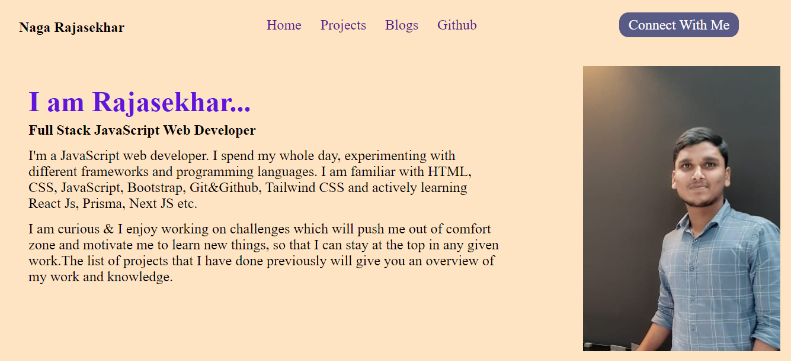

# Portfolio - HTML  and CSS 

> 
>
> By Naga Rajasekhar

You can find the live deployment link of this web page here --> **[Live Deployment Link](#)**
 
 
 
 

 

### Learnings from completing this project

1. Gained knowledge about postions and its properties 
2. Learnt about Grid and its properties
3. Learnt about box-shadow concept
4. Learnt about flex-box and its properties
5. Gained knowledge about padding, margin, colors, border and their values
